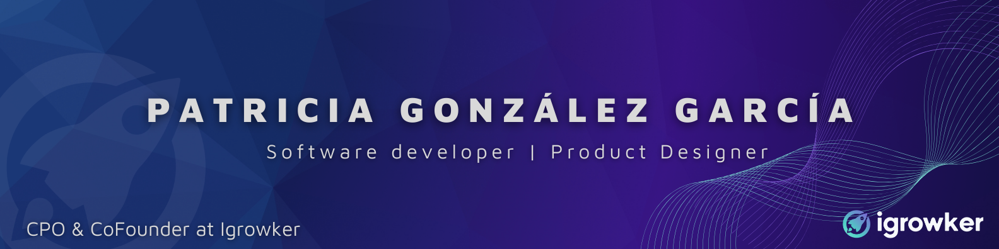

## 🛠️ Technical Proficiencies

-   **Technologies**: Javascript, Typescript, Python, Streamlit, React, NodeJs, NextJs, TailwindJs, Express, HTML5, CSS3, SASS, MySQL, MongoDB.
-   **Design Tools**: Photoshop, Illustrator, Figma, UIzard, Sketch.
-   **Others**: Git & GitHub, Responsive Design, Chakra UI, MUI, Ant-Design, BitBucket.

## 🌐 Connect

-   
-   

## 📈 GitHub Overview

---

Thank you for stopping by. Explore my repositories for more on what I do.
